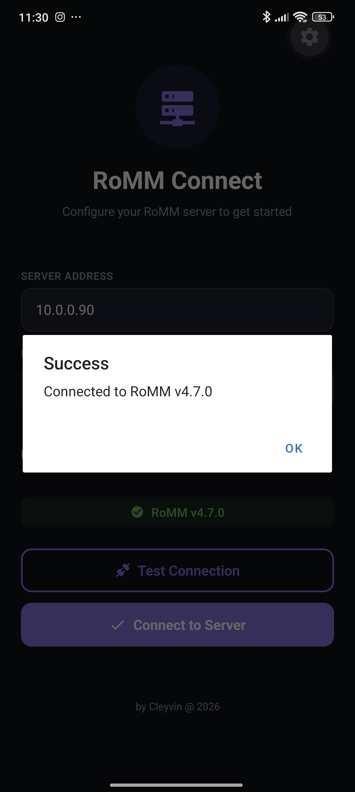
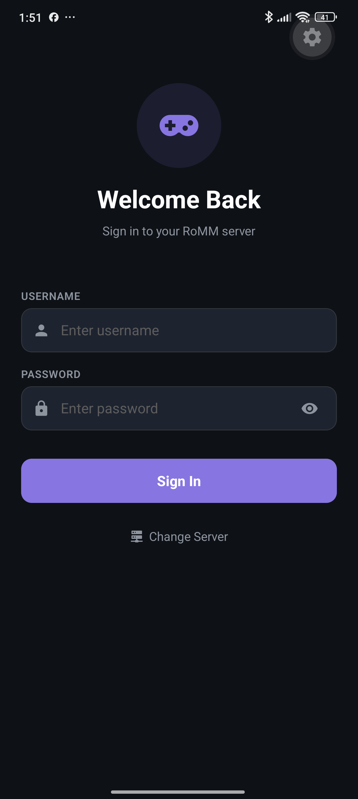
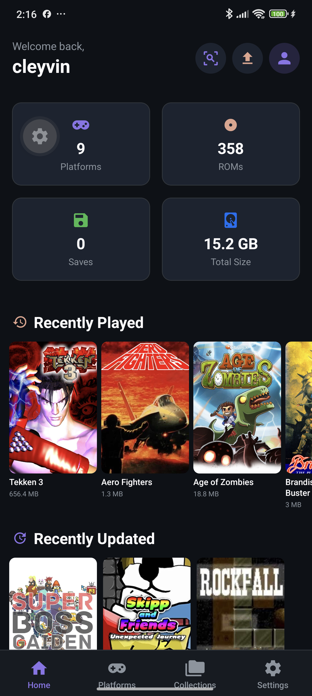
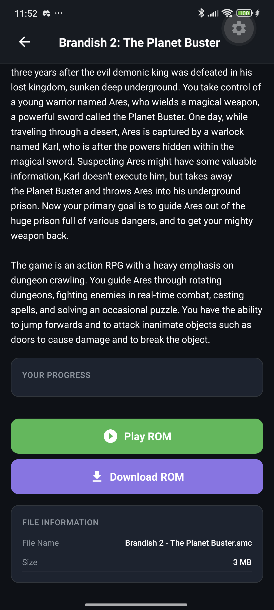
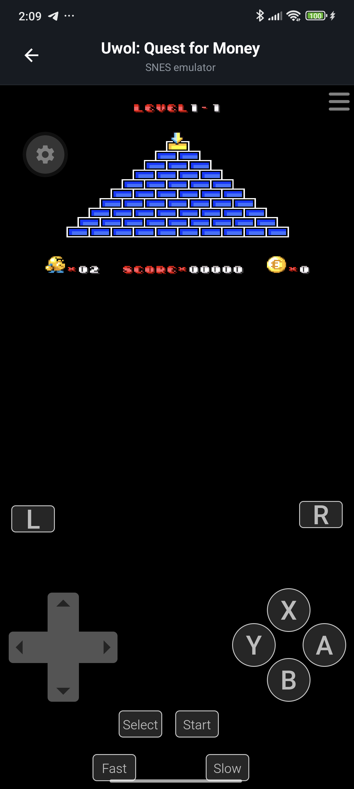

# RoMM Connect

A mobile client for [RoMM](https://github.com/rommapp/romm) (ROM Manager) - browse, play, and manage your retro game collection from your phone.

**by Cleyvin @ 2026**

[](https://www.paypal.com/donate/?hosted_button_id=&business=cleyvinos@gmail.com&currency_code=USD)

> This app is free and open source. If you enjoy it, consider supporting the developer!

---

## Screenshots

<p align="center">
  
  
  
  
  
</p>

---

## Features

### Core
- **Server Configuration** — Connect to any RoMM server via IP/port with connection test
- **OAuth2 Authentication** — Secure login with automatic token refresh
- **Dashboard** — Stats (platforms, ROMs, saves, storage), recently played, recently updated
- **Dark/Light Theme** — Matches RoMM's aesthetic (purple accent, dark background)

### Browse & Play
- **Platform Browser** — Grid view of all platforms with search, logos, and ROM count
- **ROM Gallery** — Infinite scroll grid with covers, search, and region badges
- **ROM Detail** — Full metadata: description, genres, regions, languages, file info, play history
- **Play ROM** — EmulatorJS emulator runs directly on your device (SNES, NES, GBA, N64, PSX, PSP, Genesis, Arcade, and more)
- **Download Progress** — Visual progress bar with percentage and file size when loading games

### Manage
- **Upload ROMs** — Pick files from your device and upload to any platform on the server
- **Scan Library** — Detect new ROMs on the server and fetch metadata/covers
- **Collections** — Browse your ROM collections
- **Save States** — EmulatorJS slot-based save/load system
- **Play Tracking** — Tracks last played date and now playing status

---

## Tech Stack

| Layer | Technology |
|-------|-----------|
| Framework | React Native + Expo (TypeScript) |
| Navigation | React Navigation (Stack + Bottom Tabs) |
| API Client | Axios with OAuth2 interceptors |
| State | React Context |
| Emulation | EmulatorJS (loaded from CDN) |
| Theme | Custom theme matching RoMM's Vuetify design |

---

## Installation

### APK Download
Download the latest APK from [Releases](https://github.com/iCleyvin/romm-connect/releases).

### Development Setup

```bash
# Clone
git clone https://github.com/iCleyvin/romm-connect.git
cd romm-connect

# Install dependencies
npm install

# Run with Expo
npx expo start
```

### Build APK

```bash
# Prebuild Android
npx expo prebuild --platform android --no-install

# Enable cleartext traffic (for HTTP servers)
# Add android:usesCleartextTraffic="true" to AndroidManifest.xml

# Build
cd android && ./gradlew assembleRelease
```

The APK will be at `android/app/build/outputs/apk/release/app-release.apk`

---

## Connecting to RoMM

1. Open the app and enter your RoMM server IP and port
2. Tap **Test Connection** to verify
3. Tap **Connect to Server**
4. Login with your RoMM credentials
5. Browse and play!

### Requirements
- RoMM server v3.x or v4.x running
- Network access to your server (LAN or VPN)
- Android 7.0+ device

---

## Supported Platforms

| Platform | EmulatorJS Core |
|----------|----------------|
| NES | nes |
| SNES | snes |
| Nintendo 64 | n64 |
| Game Boy | gb |
| Game Boy Color | gb |
| Game Boy Advance | gba |
| Nintendo DS | nds |
| PlayStation | psx |
| PSP | psp |
| Sega Genesis | segaMD |
| Sega Master System | segaMS |
| Arcade / MAME | mame2003 |
| Atari 2600 | atari2600 |

---

## Architecture

```
src/
├── api/          → API client, auth, platforms, roms, collections, saves, upload, tasks
├── theme/        → Colors (dark/light), spacing, typography
├── constants/    → Storage keys, API paths
├── types/        → TypeScript interfaces
├── store/        → AppContext (global state)
├── hooks/        → useTheme, useAuth, useAuthHeaders
├── utils/        → formatFileSize, getCoverUrl, getRomCoverUrl
├── navigation/   → AppNavigator (Stack), MainTabs (Bottom Tabs)
├── components/   → Cards (Platform, Rom, Collection), Common (Header, Loading, Empty)
└── screens/      → ServerConfig, Login, Home, Platforms, RomGallery, RomDetail,
                    Play, Collections, Settings, Upload
```

---

## API Integration

RoMM Connect communicates with RoMM via its REST API:

- **Auth**: `POST /api/token` (OAuth2 password grant with scopes)
- **Platforms**: `GET /api/platforms`, `POST /api/platforms` (scan)
- **ROMs**: `GET /api/roms` (paginated), `GET /api/roms/{id}`
- **Upload**: `POST /api/roms` (multipart/form-data, field name = filename)
- **Stats**: `GET /api/stats`
- **Heartbeat**: `GET /api/heartbeat`
- **User**: `GET /api/users/me`, `PUT /api/roms/{id}/props`
- **Collections**: `GET /api/collections`
- **Assets**: `GET /api/raw/assets/{path}` (covers, logos)

---

## Support the Project

If RoMM Connect has been useful to you, consider making a donation. Every contribution helps keep the project alive!

[](https://www.paypal.com/donate/?hosted_button_id=&business=cleyvinos@gmail.com&currency_code=USD)

---

## License

MIT

---

*Built with React Native, Expo, and EmulatorJS. Powered by RoMM.*
