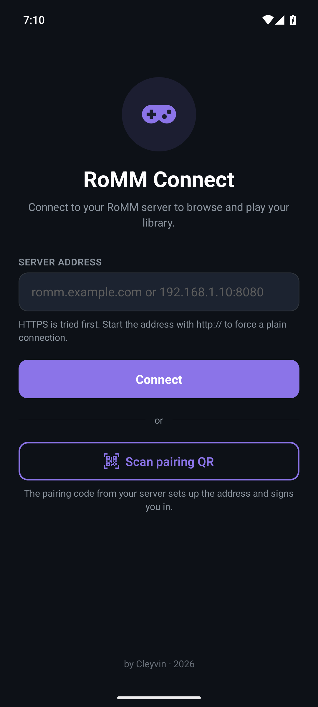
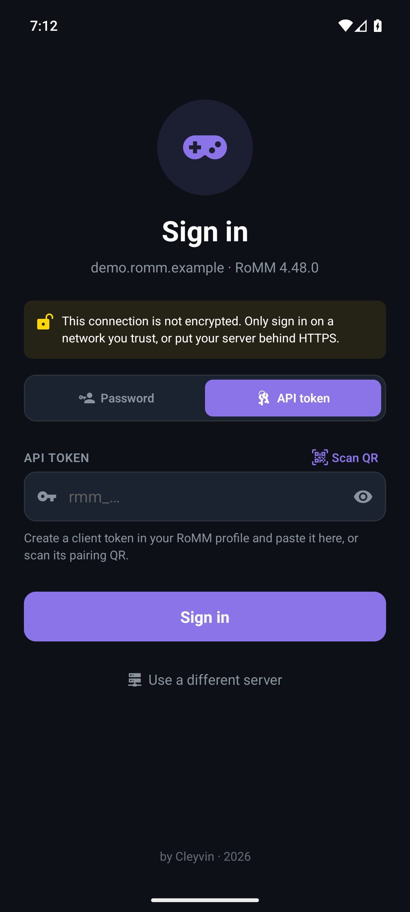
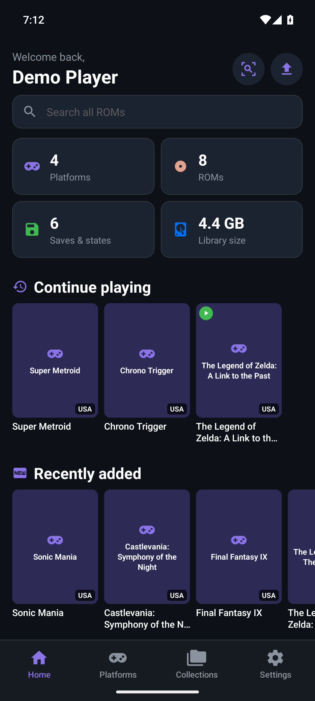
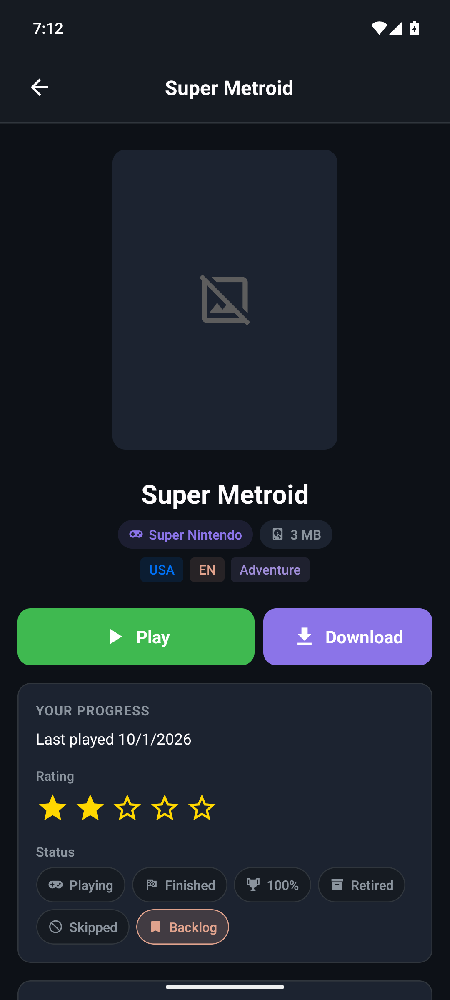
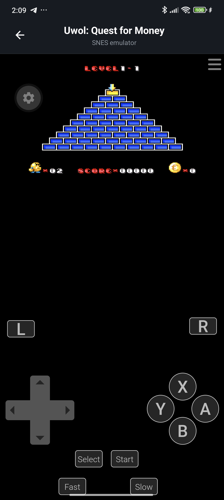

# RoMM Connect

A mobile client for [RoMM](https://github.com/rommapp/romm) (ROM Manager) - browse, play, and manage your retro game collection from your phone.

**by Cleyvin @ 2026**

[](https://www.paypal.com/donate/?hosted_button_id=&business=cleyvinos@gmail.com&currency_code=USD)

> This app is free and open source. If you enjoy it, consider supporting the developer!

---

## Screenshots

<p align="center">
  
  
  
  
  
</p>

---

## Features

- **Connect** — type your server address (HTTPS is tried first, then HTTP) or scan a RoMM pairing QR to set up the server and sign in at once
- **Sign in** — username/password (OAuth2 with automatic token refresh) or a RoMM API token; the session is kept in the device keystore and the password is never stored
- **Dashboard** — library stats, continue playing, recently added, global search
- **Browse** — platforms, collections and smart collections, with infinite scroll and per-section search
- **ROM details** — cover, metadata, screenshots, rating, play status and backlog
- **Play** — EmulatorJS in-app, using the copy bundled with your RoMM server (CDN fallback), with BIOS files from the platform's firmware
- **Cloud saves** — battery saves are restored when a game starts and uploaded while you play and when you leave; save states go to the server from the emulator menu
- **Download** — save any ROM to a folder on the device, streamed so large files do not exhaust memory
- **Upload & scan** — chunked ROM uploads and library scans for accounts with permission
- **Dark / light theme**

---

## Tech Stack

| Layer | Technology |
|-------|-----------|
| Framework | React Native 0.83 + Expo SDK 55 (TypeScript) |
| Navigation | React Navigation (native stack + bottom tabs) |
| Data | Axios + TanStack Query |
| State | React Context |
| Emulation | EmulatorJS in a WebView |
| OTA updates | hot-updater |

---

## Installation

### APK Download
Download the latest APK from [Releases](https://github.com/iCleyvin/romm-connect/releases).

### Development Setup

```bash
# Clone
git clone https://github.com/iCleyvin/romm-connect.git
cd romm-connect

# Install dependencies
npm install

# Run with Expo
npx expo start
```

### Build APK

```bash
# Prebuild Android
npx expo prebuild --platform android --no-install

# Build
cd android && ./gradlew assembleRelease
```

The APK will be at `android/app/build/outputs/apk/release/app-release.apk`

---

## Connecting to RoMM

1. Open the app and enter your RoMM server address, or scan a pairing QR from RoMM
2. Sign in with your RoMM account or an API token
3. Browse and play!

### Requirements
- A RoMM 4.x server
- Network access to your server (LAN or VPN)
- Android 7.0+ device

---

## Supported Platforms

Any platform the RoMM web player can run with EmulatorJS: NES, SNES, N64, Game Boy / Color / Advance, Nintendo DS, PlayStation, Genesis / Mega Drive, Master System, Game Gear, Sega CD, 32X, Saturn, Arcade, Neo Geo, Atari, Commodore, TurboGrafx and more. The full table lives in `src/config/emulation.ts`.

PSP and DOS cores need multi-threading that an in-app web view cannot provide; those games open in your browser instead.

---

## Architecture

```
src/
├── api/          → HTTP client, session storage, and one module per RoMM resource
├── config/       → Platform → EmulatorJS core table
├── emulator/     → The HTML page the Play screen runs
├── store/        → AppContext (server, session, theme)
├── navigation/   → Stack that follows the auth state, bottom tabs
├── hooks/        → Debounce, responsive grid, refetch on focus
├── components/   → Cards and shared UI
├── screens/      → ServerConfig, Login, Home, Platforms, Collections,
│                   RomGallery, RomDetail, Play, Upload, Settings
└── theme/, constants/, types/, utils/
```

---

## API Integration

RoMM Connect communicates with RoMM via its REST API:

- **Auth**: `POST /api/token` (OAuth2 password grant with scopes)
- **Platforms**: `GET /api/platforms`, `POST /api/platforms` (scan)
- **ROMs**: `GET /api/roms` (paginated), `GET /api/roms/{id}`
- **Upload**: `POST /api/roms` (multipart/form-data, field name = filename)
- **Stats**: `GET /api/stats`
- **Heartbeat**: `GET /api/heartbeat`
- **User**: `GET /api/users/me`, `PUT /api/roms/{id}/props`
- **Collections**: `GET /api/collections`
- **Assets**: `GET /api/raw/assets/{path}` (covers, logos)

---

## Support the Project

If RoMM Connect has been useful to you, consider making a donation. Every contribution helps keep the project alive!

[](https://www.paypal.com/donate/?hosted_button_id=&business=cleyvinos@gmail.com&currency_code=USD)

---

## License

MIT

---

*Built with React Native, Expo, and EmulatorJS. Powered by RoMM.*
